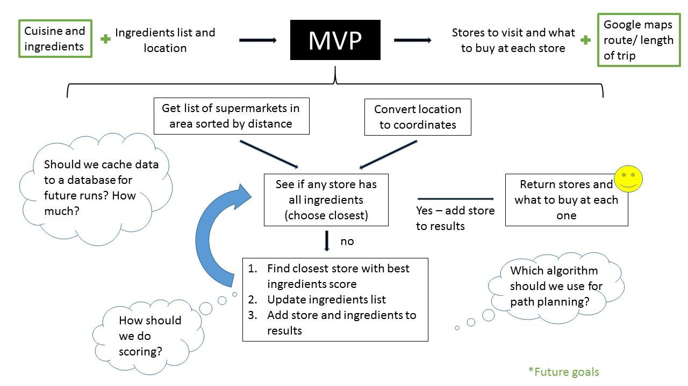

# Grocery Helper Architecture Review
[Maggie Rosner](https://github.com/MargaretRosner), [Elena Meyerson](https://github.com/elenameyerson), [Kyle Combes](https://github.com/kylecombes), and [Nina Tchircova](https://github.com/ntchirkova)

### Agenda
We are hoping to have an open discussion about our key questions with our audience. Our key questions highlight major design decisions we have to make about how to choose the user's route to get everything on their grocery list. To communicate with our audience, we will have a visual flow chart that we will distribute at the beginning of the review. The audience can use the flowchart as a tool to follow along and take notes with as we talk.

| Time        | Length | Objective                                                                                                                   |
|-------------|--------|-----------------------------------------------------------------------------------------------------------------------------|
| 0:00 - 0:05 | 5 min  | Distribute flowcharts and introduce background and context and answer questions about the background information introduced |
| 0:05 - 0:10 | 5 min  | Discuss key question 1:,Which algorithm should we use for path planning?                                                    |
| 0:15 - 0:20 | 10 min | Discuss key question 2: How should we do scoring? # ingredients vs distance? # stops vs total distance?                     |
| 0:20 - 0:25 | 5 min  | Discuss key question 3: Should we cache data to a database for future runs? How much? Answer any lingering questions.       |

### Background and Context
##### Primary Goal

Our MVP is a web app that allows users to input a grocery list and receive the nearest grocery store that has the items they need. If it requires stopping at multiple stores, it will display the optimal shopping itinerary.

##### Additional Features

* Allow users to input ingredients that they already have, or a cuisine that they are interested in, and receive a recipe with an ingredients list in addition to the above.
* Display route on Google Maps with total travel time and distance.

##### Our Data Sources

We'll be utilizing several APIs, including:

* **Supermarket API**: Provides a list of stores in a city/ZIP and the ability to search for items at those stores.
* **Recipe API**: Provides a list of recipes for different cuisines, as well as a list of ingredients in each recipe.
* **Google Maps API**: Converts addresses into coordinates, finds routes between places, and calculates transit distances between places.

##### User Inputs and Program Outputs

Potential user inputs:
* Location (address)
* List of ingredients
* Search radius
* Specific recipe

Potential program outputs:
* List of stores
* Ingredients to purchase at that store
* Travel route
* Travel time
* Suggested recipe
* List of ingredients for recipe

## Key Questions

1. Which algorithm should we use for planning?
2. How should we score routes (while planning)? Based on # stops and total distance? Something else?
3. Should we cache the data to a database for future runs? How much of the data should we cache? (total time for requests = 200-500 ms * # stores * # ingredients)